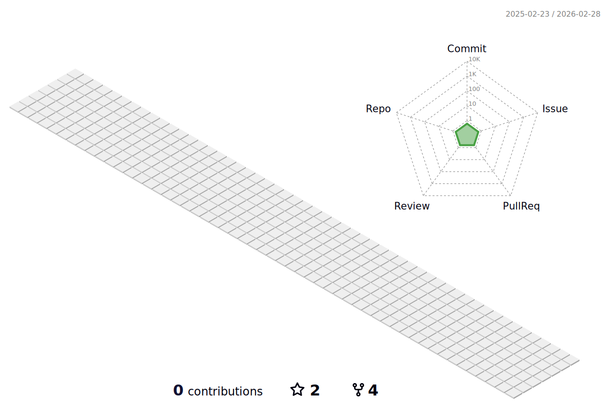

<!---
<h1 align="center">
  Hi , I'm Aldo Degollado
</h1>
--->

<h3 align="center">
  <picture>
      <source media="(prefers-color-scheme: dark)" srcset="https://readme-typing-svg.demolab.com?font=Montserrat&size=35&duration=2000&pause=1000&color=ffffff&center=true&vCenter=true&width=1000&multiline=false&lines=Hi!+I'm+Aldo+Degollado+%F0%9F%91%8B;I'm+Mexican+%F0%9F%8C%AE%F0%9F%87%B2%F0%9F%87%BD;I'm+a+Computer+Science+student+%F0%9F%91%A8%F0%9F%8F%BB%E2%80%8D%F0%9F%92%BB;I'm+a+%F0%9F%91%BE+game+developer+%F0%9F%8E%AE;I'm+a+Tec+de+Monterrey+student+%F0%9F%90%8F%F0%9F%92%99;I'm+a+big+soccer+enthusiast+%E2%9A%BD;I'm+a+Cruz+Azul+fan+%F0%9F%94%B5%E2%9A%AA;I+love+challenges!+%F0%9F%8F%86">
      <source media="(prefers-color-scheme: light)" srcset="https://readme-typing-svg.demolab.com?font=Montserrat&size=35&duration=2000&pause=1000&color=000000&center=true&vCenter=true&width=1000&multiline=false&lines=Hi!+I'm+Aldo+Degollado+%F0%9F%91%8B;I'm+Mexican+%F0%9F%8C%AE%F0%9F%87%B2%F0%9F%87%BD;I'm+a+Computer+Science+student+%F0%9F%91%A8%F0%9F%8F%BB%E2%80%8D%F0%9F%92%BB;I'm+a+%F0%9F%91%BE+game+developer+%F0%9F%8E%AE;I'm+a+Tec+de+Monterrey+student+%F0%9F%90%8F%F0%9F%92%99;I'm+a+big+soccer+enthusiast+%E2%9A%BD;I'm+a+Cruz+Azul+fan+%F0%9F%94%B5%E2%9A%AA;I+love+challenges!+%F0%9F%8F%86">
      
    </picture></a>


## 🗣️ Connect with me: 

<p align="center">
  <!--- Mail --->
  <a href="mailto:aldodegollado@hotmail.com" target="_blank" rel="noreferrer">
    </a>

  <!--- LinkedIn --->
  <a href="https://linkedin.com/in/aldo-alejandro-degollado-padilla" target="_blank" rel="noreferrer">
    </a>
  <br>
  
  <!--- Discord --->
  
  
  <!--- Facebook --->
  <a href="https://fb.com/aldoalejandro.degolladopadilla" target="_blank" rel="noreferrer">
    </a>
  
  <!--- Instagram --->
  <a href="https://instagram.com/aldodegollado" target="_blank" rel="noreferrer">
    </a>
  
  <!--- Twitter --->
  <a href="https://twitter.com/aldodegollado" target="_blank" rel="noreferrer">
    </a>
  <br>
  
  <!--- Steam --->
  <a href="https://steamcommunity.com/id/diplex_/" target="_blank" rel="noreferrer">
    </a>
  
  <!--- Xbox --->
  <a href="https://account.xbox.com/es-mx/Profile?xr=mebarnav" target="_blank" rel="noreferrer">
    </a>
</p>


## 💻 Programming, scripting and markup languages:

<p align="center">
  <!--- C++ --->
  <a href="https://www.w3schools.com/cpp/cpp_intro.asp" target="_blank" rel="noreferrer">
    </a>
  
  <br>
  
  <!--- C# --->
  <a href="https://learn.microsoft.com/en-us/dotnet/csharp/" target="_blank" rel="noreferrer">
    </a>
  
  <br>
  
  <!--- Python --->
  <a href="https://www.python.org/" target="_blank" rel="noreferrer">
    </a>
  
  <br>
  
  <!--- HTML5 y CSS3 --->
  <a href="https://www.w3schools.com/html/default.asp" target="_blank" rel="noreferrer">
    </a>
  <a href="https://www.w3schools.com/css/default.asp" target="_blank" rel="noreferrer">
    </a>
  
  <br>
  
  <!--- JavaScript --->
  <a href="https://developer.mozilla.org/en-US/docs/Web/JavaScript" target="_blank" rel="noreferrer">
    <picture>
      <source media="(prefers-color-scheme: dark)" srcset="https://img.shields.io/badge/JavaScript-F7DF1E?logo=javascript&logoColor=000&style=for-the-badge">
      <source media="(prefers-color-scheme: light)" srcset="https://img.shields.io/badge/JavaScript-000?logo=javascript&logoColor=F7DF1E&style=for-the-badge">
      
    </picture></a>
  
  <br>
  
  <!--- Matlab --->
  <a href="https://www.mathworks.com/products/matlab.html" target="_blank" rel="noreferrer">
    </a>
  
  <br>
  
  <!--- SQL --->
  <a href="https://www.w3schools.com/sql/sql_intro.asp" target="_blank" rel="noreferrer">
    </a>
  
  <br>
  
  <!--- Swift --->
  <a href="https://developer.apple.com/swift/" target="_blank" rel="noreferrer">
    </a>
  
  <br>
  
  <!--- MARIE --->
  <a href="http://samples.jbpub.com/9781449600068/00068_ch04_null3e.pdf" target="_blank" rel="noreferrer">
    </a>
  
  <br>
  
  <!--- Markdown --->
  <a href="https://www.markdownguide.org/" target="_blank" rel="noreferrer">
    <picture>
      <source media="(prefers-color-scheme: dark)" srcset="https://img.shields.io/badge/Markdown-fff.svg?logo=Markdown&logoColor=000000&style=for-the-badge">
      <source media="(prefers-color-scheme: light)" srcset="https://img.shields.io/badge/Markdown-000000.svg?logo=Markdown&logoColor=white&style=for-the-badge">
      
    </picture></a>
  
  <br>
  
  <!--- R --->
  <a href="https://www.r-project.org/" target="_blank" rel="noreferrer">
    </a>
  
  <br>
  
  <!--- Scheme --->
  <a href="https://scheme.com/" target="_blank" rel="noreferrer">
    <picture>
      <source media="(prefers-color-scheme: dark)" srcset="https://custom-icon-badges.demolab.com/badge/Scheme-fff.svg?logo=scheme&style=for-the-badge">
      <source media="(prefers-color-scheme: light)" srcset="https://custom-icon-badges.demolab.com/badge/Scheme-000.svg?logo=scheme-white&style=for-the-badge">
      
    </picture></a>
  
  <br>
  
  <!--- TypeScript --->
  <a href="https://www.typescriptlang.org/" target="_blank" rel="noreferrer">
    </a>
  
  <br>
  
  <!--- CMake --->
  <a href="https://cmake.org/" target="_blank" rel="noreferrer">
    </a>
  
  <br>
  
  <!--- Java --->
  <a href="https://www.java.com" target="_blank" rel="noreferrer">
    <picture>
      <source media="(prefers-color-scheme: dark)" srcset="https://custom-icon-badges.demolab.com/badge/Java-fff.svg?logo=java-color&style=for-the-badge">
      <source media="(prefers-color-scheme: light)" srcset="https://custom-icon-badges.demolab.com/badge/Java-3A75B0.svg?logo=java&logoColor=white&style=for-the-badge">
      
    </picture></a>
  
  <br>
  
  <!--- PowerShell --->
  <a href="https://learn.microsoft.com/en-us/powershell/scripting/overview?view=powershell-7.2" target="_blank" rel="noreferrer">
    </a>
  
  <br>
</p>


## 🛠️ My favorite tools:


### 🧰 Frameworks and libraries

<p align="center">
  <!--- Flask --->
  <a href="https://flask.palletsprojects.com/en/2.2.x/" target="_blank" rel="noreferrer">
    <picture>
      <source media="(prefers-color-scheme: dark)" srcset="https://img.shields.io/badge/Flask-fff?logo=flask&logoColor=black&style=for-the-badge">
      <source media="(prefers-color-scheme: light)" srcset="https://img.shields.io/badge/Flask-000000?logo=flask&logoColor=white&style=for-the-badge">
      
    </picture></a>
  
  <!--- GitHub Actions --->
  <a href="https://github.com/features/actions" target="_blank" rel="noreferrer">
    </a>
  
  <!--- Ionic --->
  <a href="https://ionicframework.com/" target="_blank" rel="noreferrer">
    </a>
  
  <!--- Material UI --->
  <a href="https://mui.com/" target="_blank" rel="noreferrer">
    <picture>
      <source media="(prefers-color-scheme: dark)" srcset="https://custom-icon-badges.demolab.com/badge/Material%20UI-fff.svg?logo=materialui&logoColor=007FFF&style=for-the-badge">
      <source media="(prefers-color-scheme: light)" srcset="https://custom-icon-badges.demolab.com/badge/Material%20UI-007FFF.svg?logo=materialui&logoColor=white&style=for-the-badge">
      
    </picture></a>
  
  <!--- Matplotlib --->
  <a href="https://matplotlib.org/" target="_blank" rel="noreferrer">
    </a>
  
  <!--- NPM --->
  <a href="https://www.npmjs.com/" target="_blank" rel="noreferrer">
    </a>
  
  <!--- NumPy --->
  <a href="https://numpy.org/" target="_blank" rel="noreferrer">
    </a>
  
  <!--- OpenCV --->
  <a href="https://opencv.org/" target="_blank" rel="noreferrer">
    </a>
  
  <!--- OpenGL --->
  <a href="https://www.opengl.org/" target="_blank" rel="noreferrer">
    </a>
  
  <!--- Pandas --->
  <a href="https://pandas.pydata.org/" target="_blank" rel="noreferrer">
    </a>
  
  <!--- React --->
  <a href="https://es.reactjs.org/" target="_blank" rel="noreferrer">
    </a>
  
  <!--- Three.js --->
  <a href="https://threejs.org/" target="_blank" rel="noreferrer">
    <picture>
      <source media="(prefers-color-scheme: dark)" srcset="https://custom-icon-badges.demolab.com/badge/Three.js-fff.svg?logo=three.js&logoColor=black&style=for-the-badge">
      <source media="(prefers-color-scheme: light)" srcset="https://custom-icon-badges.demolab.com/badge/Three.js-000.svg?logo=three.js&logoColor=white&style=for-the-badge">
      
    </picture></a>
</p>

### 🗄️ Databases, cloud storage and cloud hosting

<p align="center">
  <!--- Dropbox --->
  <a href="https://www.dropbox.com/es/" target="_blank" rel="noreferrer">
      </a>
  
  <!--- Google Drive --->
  <a href="https://www.google.com/intl/es/drive/" target="_blank" rel="noreferrer">
    </a>
  
  <!--- Firebase --->
  <a href="https://firebase.google.com/" target="_blank" rel="noreferrer">
    </a>
  
  <!--- IBM Cloud --->
  <a href="https://cloud.ibm.com/" target="_blank" rel="noreferrer">
    <picture>
      <source media="(prefers-color-scheme: dark)" srcset="https://custom-icon-badges.demolab.com/badge/IBM%20Cloud-fff.svg?logo=ibm-cloud-color&style=for-the-badge">
      <source media="(prefers-color-scheme: light)" srcset="https://img.shields.io/badge/IBM%20Cloud-000.svg?logo=ibm-cloud&logoColor=white&style=for-the-badge">
      
    </picture></a>
  
  <!--- iCloud --->
  <a href="https://www.icloud.com/" target="_blank" rel="noreferrer">
    </a>
  
  <!--- OneDrive --->
  <a href="https://onedrive.live.com/" target="_blank" rel="noreferrer">
    </a>
  
  <!--- MongoDB --->
  <a href="https://www.mongodb.com/" target="_blank" rel="noreferrer">
    <picture>
      <source media="(prefers-color-scheme: dark)" srcset="https://img.shields.io/badge/MongoDB-00EE64?style=for-the-badge&logo=mongodb&logoColor=white">
      <source media="(prefers-color-scheme: light)" srcset="https://img.shields.io/badge/MongoDB-011E2A?style=for-the-badge&logo=mongodb&logoColor=white">
      
    </picture></a>
  
  <!--- MySQL --->
  <a href="https://www.mysql.com/" target="_blank" rel="noreferrer">
    <picture>
      <source media="(prefers-color-scheme: dark)" srcset="https://custom-icon-badges.demolab.com/badge/-MySQL-fff?logo=mysql_official_logo_icon_169938&style=for-the-badge">
      <source media="(prefers-color-scheme: light)" srcset="https://img.shields.io/badge/MySQL-00618A?logo=mysql&logoColor=E48E00&style=for-the-badge">
      
    </picture></a>
  
  <!--- PostgreSQL --->
  <a href="https://www.postgresql.org/" target="_blank" rel="noreferrer">
    </a>
</p>

### ⌨️ IDEs, editors and game engines

<p align="center">
  <!--- Apache NetBeans --->
  <a href="https://netbeans.apache.org/" target="_blank" rel="noreferrer">
    </a>
  
  <!--- Arduino IDE --->
  <a href="https://www.arduino.cc/" target="_blank" rel="noreferrer">
    </a>
  
  <!--- Brackets --->
  <a href="https://brackets.io/" target="_blank" rel="noreferrer">
    </a>
  
  <!--- Code::Blocks --->
  <a href="https://www.codeblocks.org/" target="_blank" rel="noreferrer">
      </a>
  
  <!--- Colab --->
  <a href="https://colab.research.google.com/" target="_blank" rel="noreferrer">
      </a>
  
  <!--- IntelliJ IDEA --->
  <a href="https://www.jetbrains.com/idea/" target="_blank" rel="noreferrer">
      </a>
  
  <!--- Jupyter --->
  <a href="https://jupyter.org/" target="_blank" rel="noreferrer">
      </a>
  
  <!--- Marie.js --->
  <a href="https://marie-js.github.io/" target="_blank" rel="noreferrer">
      </a>
  
  <!--- MySQL Workbench --->
  <a href="https://www.mysql.com/products/workbench/" target="_blank" rel="noreferrer">
    <picture>
      <source media="(prefers-color-scheme: dark)" srcset="https://custom-icon-badges.demolab.com/badge/MySQL%20Workbench-fff?logo=mysql_official_logo_icon_169938&style=for-the-badge">
      <source media="(prefers-color-scheme: light)" srcset="https://img.shields.io/badge/MySQL%20Workbench-00618A?logo=mysql&logoColor=E48E00&style=for-the-badge">
      
    </picture></a>
  
  <!--- Notepad++ --->
  <a href="https://notepad-plus-plus.org/" target="_blank" rel="noreferrer">
      </a>
  
  <!--- Thonny --->
  <a href="https://thonny.org/" target="_blank" rel="noreferrer">
      </a>
  
  <!--- Unity --->
  <a href="https://unity.com/" target="_blank" rel="noreferrer">
    <picture>
      <source media="(prefers-color-scheme: dark)" srcset="https://custom-icon-badges.demolab.com/badge/Unity-fff?logo=unity&logoColor=black&style=for-the-badge">
      <source media="(prefers-color-scheme: light)" srcset="https://img.shields.io/badge/Unity-000?logo=unity&logoColor=white&style=for-the-badge">
      
    </picture></a>
  
  <!--- Unreal Engine --->
  <a href="https://www.unrealengine.com/en-US" target="_blank" rel="noreferrer">
      </a>
  
  <!--- Visual Studio --->
  <a href="https://visualstudio.microsoft.com/" target="_blank" rel="noreferrer">
      </a>
  
  <!--- Visual Studio Code --->
  <a href="https://code.visualstudio.com/" target="_blank" rel="noreferrer">
      </a>
  
  <!--- Windows Terminal --->
  <a href="https://github.com/microsoft/terminal" target="_blank" rel="noreferrer">
      </a>
  
  <!--- Xcode --->
  <a href="https://developer.apple.com/xcode/" target="_blank" rel="noreferrer">
      </a>
</p>


### 💽 Product and version control
  
<p align="center">
  <!--- Docker --->
  <a href="https://www.docker.com/" target="_blank" rel="noreferrer">
      </a>
  
  <!--- Git --->
  <a href="https://git-scm.com/" target="_blank" rel="noreferrer">
      </a>
  
  <!--- GitHub --->
  <a href="https://github.com/" target="_blank" rel="noreferrer">
    <picture>
      <source media="(prefers-color-scheme: dark)" srcset="https://img.shields.io/badge/GitHub-fff?logo=github&logoColor=black&style=for-the-badge">
      <source media="(prefers-color-scheme: light)" srcset="https://img.shields.io/badge/GitHub-000?logo=github&logoColor=white&style=for-the-badge">
      
    </picture></a>
  
  <!--- GitHub Desktop --->
  <a href="https://desktop.github.com/" target="_blank" rel="noreferrer">
      </a>
  
  <!--- gitignore.io --->
  <a href="https://gitignore.io/" target="_blank" rel="noreferrer">
      </a>
  
  <!--- Perforce Helix Core --->
  <a href="https://www.perforce.com/products/helix-core" target="_blank" rel="noreferrer">
      </a>
  
  <!--- Plastic SCM --->
  <a href="https://www.plasticscm.com/" target="_blank" rel="noreferrer">
    <picture>
      <source media="(prefers-color-scheme: dark)" srcset="https://custom-icon-badges.demolab.com/badge/Plastic%20SCM-FF4300?logo=plastic-scm&logoColor=white&style=for-the-badge">
      <source media="(prefers-color-scheme: light)" srcset="https://custom-icon-badges.demolab.com/badge/Plastic%20SCM-172A51?logo=plastic-scm&style=for-the-badge">
      
    </picture></a>
</p>

### 🖥️ Other softwares and technologies
  
<p align="center">
  <!--- Adobe Acrobat Reader --->
  <a href="https://www.adobe.com/acrobat/pdf-reader.html" target="_blank" rel="noreferrer">
      </a>
  
  <!--- Adobe Substance 3D Painter --->
  <a href="https://www.substance3d.com/" target="_blank" rel="noreferrer">
      </a>
  
  <!--- Autodesk Maya --->
  <a href="https://www.autodesk.com/products/maya/overview" target="_blank" rel="noreferrer">
      </a>
  
  <!--- Boxy SVG --->
  <a href="https://boxy-svg.com/" target="_blank" rel="noreferrer">
    <picture>
      <source media="(prefers-color-scheme: dark)" srcset="https://custom-icon-badges.demolab.com/badge/Boxy%20SVG-3A3A3A?logo=boxy-svg-color&style=for-the-badge">
      <source media="(prefers-color-scheme: light)" srcset="https://custom-icon-badges.demolab.com/badge/Boxy%20SVG-242424?logo=boxy-svg-color&style=for-the-badge">
      </a>
    </picture></a>
  
  <!--- Chocolatey --->
  <a href="https://chocolatey.org/" target="_blank" rel="noreferrer">
      </a>
  
  <!--- Cisco Packet Tracer --->
  <a href="https://www.netacad.com/courses/packet-tracer" target="_blank" rel="noreferrer">
      </a>
  
  <!--- DeepL --->
  <a href="https://www.deepl.com/translator" target="_blank" rel="noreferrer">
    </a>
  
  <!--- Diagrams.net --->
  <a href="https://www.diagrams.net/" target="_blank" rel="noreferrer">
      </a>
  
  <!--- Discord --->
  <a href="https://discord.com/" target="_blank" rel="noreferrer">
    </a>
  
  <!--- Figma --->
  <a href="https://www.figma.com/" target="_blank" rel="noreferrer">
      </a>
  
  <!--- FileZilla --->
  <a href="https://filezilla-project.org/" target="_blank" rel="noreferrer">
      </a>
  
  <!--- Geogebra --->
  <a href="https://www.geogebra.org/" target="_blank" rel="noreferrer">
      </a>
  
  <!--- GitHub Copilot --->
  <a href="https://github.com/features/copilot" target="_blank" rel="noreferrer">
      </a>
  
  <!--- Grammarly --->
  <a href="https://www.grammarly.com/" target="_blank" rel="noreferrer">
      </a>
  
  <!--- Icons8 --->
  <a href="https://icons8.com/" target="_blank" rel="noreferrer">
      </a>
  
  <!--- Jamboard --->
  <a href="https://workspace.google.com/products/jamboard/" target="_blank" rel="noreferrer">
      </a>
  
  <!--- Jira Software --->
  <a href="https://www.atlassian.com/software/jira" target="_blank" rel="noreferrer">
      </a>
  
  <!--- Kaspersky --->
  <a href="https://www.kaspersky.com/" target="_blank" rel="noreferrer">
      </a>
  
  <!--- Kaspersky Password Manager --->
  <a href="https://www.kaspersky.com/password-manager" target="_blank" rel="noreferrer">
      </a>
  
  <!--- Microsoft Excel --->
  <a href="https://www.microsoft.com/en-us/microsoft-365/excel" target="_blank" rel="noreferrer">
      </a>
  
  <!--- Microsoft Paint --->
  <a href="https://apps.microsoft.com/store/detail/paint/9PCFS5B6T72H" target="_blank" rel="noreferrer">
      </a>
  
  <!--- Microsoft Powerpoint --->
  <a href="https://www.microsoft.com/en-us/microsoft-365/powerpoint" target="_blank" rel="noreferrer">
      </a>
  
  <!--- Microsoft Teams --->
  <a href="https://www.microsoft.com/en-us/microsoft-teams/group-chat-software" target="_blank" rel="noreferrer">
      </a>
  
  <!--- Microsoft Word --->
  <a href="https://www.microsoft.com/en-us/microsoft-365/word" target="_blank" rel="noreferrer">
      </a>
  
  <!--- Mirillis Action! --->
  <a href="https://mirillis.com/es/productos/action-grabacion-de-pantalla-y-videojuegos.html" target="_blank" rel="noreferrer">
      </a>
  
  <!--- Miro --->
  <a href="https://miro.com/" target="_blank" rel="noreferrer">
    <picture>
      <source media="(prefers-color-scheme: dark)" srcset="https://custom-icon-badges.demolab.com/badge/Miro-FFD02F?logo=miro-color&style=for-the-badge">
      <source media="(prefers-color-scheme: light)" srcset="https://custom-icon-badges.demolab.com/badge/Miro-050038?logo=miro-color&style=for-the-badge">
      
    </picture></a>
  
  <!--- Paint.net --->
  <a href="https://www.getpaint.net/" target="_blank" rel="noreferrer">
      </a>
  
  <!--- Postman --->
  <a href="https://www.postman.com/" target="_blank" rel="noreferrer">
      </a>
  
  <!--- Simple Icons --->
  <a href="https://simpleicons.org/" target="_blank" rel="noreferrer">
    <picture>
      <source media="(prefers-color-scheme: dark)" srcset="https://img.shields.io/badge/Simple%20Icons-fff?logo=simpleicons&logoColor=111&style=for-the-badge">
      <source media="(prefers-color-scheme: light)" srcset="https://img.shields.io/badge/Simple%20Icons-111?logo=simpleicons&logoColor=fff&style=for-the-badge">
      
    </picture></a>
  
  <!--- Sketchfab --->
  <a href="https://sketchfab.com/" target="_blank" rel="noreferrer">
      </a>
  
  <!--- Slack --->
  <a href="https://slack.com/" target="_blank" rel="noreferrer">
      </a>
  
  <!--- Surfshark --->
  <a href="https://surfshark.com/" target="_blank" rel="noreferrer">
    <picture>
      <source media="(prefers-color-scheme: dark)" srcset="https://custom-icon-badges.demolab.com/badge/Surfshark-fff?logo=surfshark-color&style=for-the-badge">
      <source media="(prefers-color-scheme: light)" srcset="https://custom-icon-badges.demolab.com/badge/Surfshark-178A9E?logo=surfshark&style=for-the-badge">
      
    </picture></a>
  
  <!--- Trello --->
  <a href="https://trello.com/en" target="_blank" rel="noreferrer">
      </a>
  
  <!--- Wolfram Alpha --->
  <a href="https://www.wolframalpha.com/" target="_blank" rel="noreferrer">
      </a>
  
  <!--- XAMPP --->
  <a href="https://www.apachefriends.org/es/index.html" target="_blank" rel="noreferrer">
      </a>
  
  <!--- Zoom --->
  <a href="https://zoom.us/" target="_blank" rel="noreferrer">
      </a>
</p>

### 📚 Learning platforms

<p align="center">
  <!--- Coursera --->
  <a href="https://www.coursera.org/" target="_blank" rel="noreferrer">
    </a>
  
  <!--- Domestika --->
  <a href="https://www.domestika.org/" target="_blank" rel="noreferrer">
    </a>
  
  <!--- Duolingo --->
  <a href="https://www.duolingo.com/" target="_blank" rel="noreferrer">
    <picture>
      <source media="(prefers-color-scheme: dark)" srcset="https://custom-icon-badges.demolab.com/badge/Duolingo-89e219?logo=duolingo-icon-color&style=for-the-badge">
      <source media="(prefers-color-scheme: light)" srcset="https://custom-icon-badges.demolab.com/badge/Duolingo-89e219?logo=duolingo-color&style=for-the-badge">
      
    </picture></a>
  
  <!--- EBAC --->
  <a href="https://ebac.mx/" target="_blank" rel="noreferrer">
    <picture>
      <source media="(prefers-color-scheme: dark)" srcset="https://custom-icon-badges.demolab.com/badge/EBAC-fff?logo=ebac&logoColor=black&style=for-the-badge">
      <source media="(prefers-color-scheme: light)" srcset="https://custom-icon-badges.demolab.com/badge/EBAC-000?logo=ebac&logoColor=white&style=for-the-badge">
      
    </picture></a>
  
  <!--- HackerRank --->
  <a href="https://www.hackerrank.com/products/main/" target="_blank" rel="noreferrer">
      </a>
  
  <!--- Khan Academy --->
  <a href="https://es.khanacademy.org/" target="_blank" rel="noreferrer">
    <picture>
      <source media="(prefers-color-scheme: dark)" srcset="https://custom-icon-badges.demolab.com/badge/Khan%20Academy-14BF96?logo=khan-academy&logoColor=white&style=for-the-badge">
      <source media="(prefers-color-scheme: light)" srcset="https://custom-icon-badges.demolab.com/badge/Khan%20Academy-0A2A66?logo=khan-academy-color&style=for-the-badge">
      
    </picture></a>
  
  <!--- Platzi --->
  <a href="https://platzi.com/" target="_blank" rel="noreferrer">
      </a>
  
  <!--- Udemy --->
  <a href="https://www.udemy.com/" target="_blank" rel="noreferrer">
      </a>
</p>


## :octocat: My GitHub Stats:

<details>
  <summary align="center">📊 General Stats</summary>
  <p align="center">
    <picture>
      <source media="(prefers-color-scheme: dark)" srcset="https://github-readme-stats.vercel.app/api?username=diplex09&show_icons=true&locale=en&theme=tokyonight">
      <source media="(prefers-color-scheme: light)" srcset="https://github-readme-stats.vercel.app/api?username=diplex09&show_icons=true&locale=en">
      
    </picture>
  </p>
</details>

<details>
  <summary align="center">🧬 3D Stats</summary> 
  <picture>
    <source media="(prefers-color-scheme: dark)" srcset="./profile-3d-contrib/profile-night-green.svg">
    <source media="(prefers-color-scheme: light)" srcset="./profile-3d-contrib/profile-season-animate.svg">
    
  </picture>
</details>

<details>
  <summary align="center">💼 Top languages</summary>
  <p align="center">
    <picture>
      <source media="(prefers-color-scheme: dark)" srcset="https://github-readme-stats.vercel.app/api/top-langs/?username=diplex09&layout=compact&langs_count=10&theme=tokyonight&hide=jupyter+notebook%2chtml%2cmakefile">
      <source media="(prefers-color-scheme: light)" srcset="https://github-readme-stats.vercel.app/api/top-langs/?username=diplex09&layout=compact&langs_count=10&hide=jupyter+notebook%2chtml%2cmakefile">
      
    </picture>
    <br>
    <b>Note:</b> Top languages is only a metric of the languages my public code consists of and doesn't reflect experience or skill level.
  </p>
</details> 
 
<details> 
  <summary align="center"> :fire: Streak stats</summary>
  <p align="center">
    <picture>
      <source media="(prefers-color-scheme: dark)" srcset="https://github-readme-streak-stats.herokuapp.com/?user=diplex09&theme=tokyonight">
      <source media="(prefers-color-scheme: light)" srcset="https://github-readme-streak-stats.herokuapp.com/?user=diplex09">
      
    </picture>
  </p>
</details>

<details>
<summary align="center">📈 Contribution Graph</summary>
  <p align="center">
    <a href="https://github.com/ashutosh00710/github-readme-activity-graph" target="_blank" rel="noreferrer">
      <picture>
        <source media="(prefers-color-scheme: dark)" srcset="https://activity-graph.herokuapp.com/graph?username=Diplex09&theme=material-palenight&custom_title=My%20Contribution%20Graph">
        <source media="(prefers-color-scheme: light)" srcset="https://activity-graph.herokuapp.com/graph?username=Diplex09&theme=github-light&custom_title=My%20Contribution%20Graph">
        
      </picture></a>
    </p>
</details>

<details>
  <summary align="center">🏆 Achievements</summary>
  <p align="center">
    <picture>
      <source media="(prefers-color-scheme: dark)" srcset="https://github-profile-trophy.vercel.app/?username=diplex09&theme=nord">
      <source media="(prefers-color-scheme: light)" srcset="https://github-profile-trophy.vercel.app/?username=diplex09">
      
    </picture>
  </p>
</details>

<details>
  <summary align="center">📐 Metrics</summary> 
  <table align="center">
    <th colspan="2" align="center">
        <h3>🌎 Overall stats</h3>
    </th>
    <tr>
      <th align="center">🌐 General</th>
      <th align="center">👨🏼‍💻 Coding habits and Wakatime stats</th>
    </tr>
    <tr>
      <td align="center">
        </img>
      </td>
      <td align="center">
        </img>
        <br>
        </img>
      </td>
    </tr>
    <tr>
      <th colspan="2" align="center">
        <h3>🔣 Contributions</h3>
      </th>
    </tr>
    <tr>
      <th>📅 Isocalendar</th>
      <th>📆 Commit calendar</th>
    </tr>
    <tr>
      <td align="center">
        </img>
      </td>
      <td align="center">
        </img>
      </td>
    </tr>
    <tr>
      <th>🔠 Languages</th>
      <th>📤 Lines of code pushed</th>
    </tr>
    <tr>
      <td align="center">
        </img>
      </td>
      <td align="center">
        </img>
      </td>
    </tr>
    <tr>
      <th>🌤️ Skyline</th>
      <th>🌁 Skyline City</th>
    </tr>
    <tr>
      <td align="center">
        </img>
      </td>
      <td align="center">
        </img>
      </td>
    </tr>
    <tr>
      <th colspan="2" align="center">
        <h3>🗂️ Repositories and projects</h3>
      </th>
    </tr>
    <tr>
      <th>📍 Featured repositories and notable contributions</th>
      <th>🎯 Projects</th>
    </tr>
    <tr>
      <td align="center">
        </img>
        <br>
        </img>
      </td>
      <td align="center">
        </img>
      </td>
    </tr>
    <tr>
      <th>🚩 Issues and pull requests</th>
      <th>🆕 Recent activity</th>
    </tr>
    <tr>
      <td align="center">
        </img>
        <br>
        </img>
      </td>
      <td align="center">
        </img>
      </td>
    </tr>
    <tr>
      <th colspan="2" align="center">
        <h3>🎶 Spotify</h3>
      </th>
    </tr>
    <tr>
      <th>▶ Recently played</th>
      <th>🎵 Top tracks of last month</th>
    </tr>
    <tr>
      <td align="center">
        </img>
      </td>
      <td align="center">
        </img>
      </td>
    </tr>
    <tr>
      <th>🎼 Top artists of last month</th>
      <th>🕺🏼 Top tracks of all time</th>
    </tr>
    <tr>
      <td align="center">
        </img>
      </td>
      <td align="center">
        </img>
      </td>
    </tr>
    <tr>
      <th>👨🏼‍🎤️ Top artists of all time</th>
      <th>🎲 Random tracks from my favorite playlist</th>
    </tr>
    <tr>
      <td align="center">
        </img>
      </td>
      <td align="center">
        </img>
      </td>
    </tr>
    <tr>
      <th colspan="2" align="center">
        <h3>🎰 Miscellaneous</h3>
      </th>
    </tr>
    <tr>
      <th>🏆 Achievements</th>
      <th>🔮 Your fortune</th>
    </tr>
    <tr>
      <td align="center">
        </img>
      </td>
      <td align="center">
        </img>
      </td>
    </tr>
  </table>
</details>

<details>
  <summary align="center">⏰ WakaTime stats</summary>
  
<!--START_SECTION:waka-->


**🐱 My GitHub Data** 

> 🏆 0 Contributions in the Year 2023
 > 
> 📦 3.1 MB Used in GitHub's Storage 
 > 
> 🚫 Not Opted to Hire
 > 
> 📜 18 Public Repositories 
 > 
> 🔑 2 Private Repositories  
 > 
**I'm a Night 🦉** 

```text
🌞 Morning    23 commits     ██░░░░░░░░░░░░░░░░░░░░░░░   7.85% 
🌆 Daytime    46 commits     ████░░░░░░░░░░░░░░░░░░░░░   15.7% 
🌃 Evening    140 commits    ████████████░░░░░░░░░░░░░   47.78% 
🌙 Night      84 commits     ███████░░░░░░░░░░░░░░░░░░   28.67%

```
📅 **I'm Most Productive on Wednesday** 

```text
Monday       51 commits     ████░░░░░░░░░░░░░░░░░░░░░   17.41% 
Tuesday      37 commits     ███░░░░░░░░░░░░░░░░░░░░░░   12.63% 
Wednesday    61 commits     █████░░░░░░░░░░░░░░░░░░░░   20.82% 
Thursday     32 commits     ██░░░░░░░░░░░░░░░░░░░░░░░   10.92% 
Friday       44 commits     ███░░░░░░░░░░░░░░░░░░░░░░   15.02% 
Saturday     51 commits     ████░░░░░░░░░░░░░░░░░░░░░   17.41% 
Sunday       17 commits     █░░░░░░░░░░░░░░░░░░░░░░░░   5.8%

```


📊 **This Week I Spent My Time On** 

```text
⌚︎ Time Zone: America/Mexico_City

💬 Programming Languages: 
No Activity Tracked This Week

🔥 Editors: 
No Activity Tracked This Week

🐱‍💻 Projects: 
No Activity Tracked This Week

💻 Operating System: 
No Activity Tracked This Week

```

**I Mostly Code in C#** 

```text
C#                       4 repos             ███████░░░░░░░░░░░░░░░░░░   30.77% 
Swift                    2 repos             ███░░░░░░░░░░░░░░░░░░░░░░   15.38% 
C++                      1 repo              ██░░░░░░░░░░░░░░░░░░░░░░░   7.69% 
Makefile                 1 repo              ██░░░░░░░░░░░░░░░░░░░░░░░   7.69% 
Jupyter Notebook         1 repo              ██░░░░░░░░░░░░░░░░░░░░░░░   7.69%

```


 Last Updated on 18/01/2023 06:29:46 UTC
<!--END_SECTION:waka-->
     
</details>

<details>
  <summary align="center">🆕 Recent activity (issues and pull requests)</summary>
  
<!--START_SECTION:activity-->
1. 🎉 Merged PR [#165](https://github.com/Diplex09/videogame-prototipe/pull/165) in [Diplex09/videogame-prototipe](https://github.com/Diplex09/videogame-prototipe)
2. 🎉 Merged PR [#164](https://github.com/Diplex09/videogame-prototipe/pull/164) in [Diplex09/videogame-prototipe](https://github.com/Diplex09/videogame-prototipe)
<!--END_SECTION:activity-->
    
</details>

<details>
  <summary align="center">🎧 Music I hear</summary>
  <div align="center">
    <a href="https://spotify-github-profile.vercel.app/api/view?uid=aldodegollado&redirect=true" target="_blank" rel="noreferrer">
      <picture>
        <source media="(prefers-color-scheme: dark)" srcset="https://spotify-github-profile.vercel.app/api/view?uid=aldodegollado&cover_image=true&theme=default&show_offline=false&background_color=ffffff&bar_color=53b14f&bar_color_cover=true">
        <source media="(prefers-color-scheme: light)" srcset="https://spotify-github-profile.vercel.app/api/view?uid=aldodegollado&cover_image=true&theme=default&show_offline=false&background_color=000000&bar_color=53b14f&bar_color_cover=true">
        
      </picture></a>
  </div>
</details>


## 🐍 Daily contribution graph:

<p align="center">
  
  
</p>

<br>

<p align="center" >
  <a href="https://github.com/Diplex09/Diplex09/commits" target="_blank" rel="noreferrer">
    </a>
  
  <a href="https://github.com/Diplex09/Diplex09/actions/workflows/update-readme.yml">
      </a>
</p>
